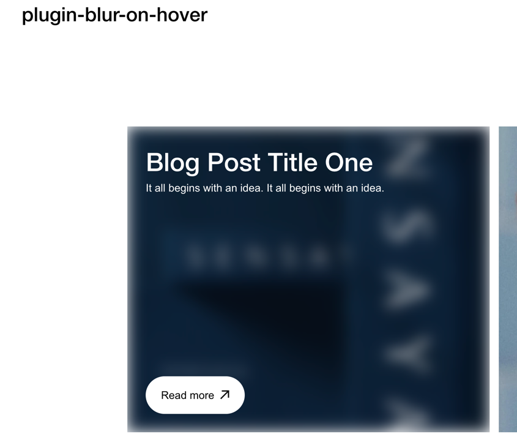

#### Code Block
``
</div
``

#### Set Blog href  
``/content-hover-on-blur-section``

#### JS: set href, sectionId, homepageId
- [JS ](src/index.js) 

#### Less: set sectionId, homepageId
- [Styles](src/style.less)

